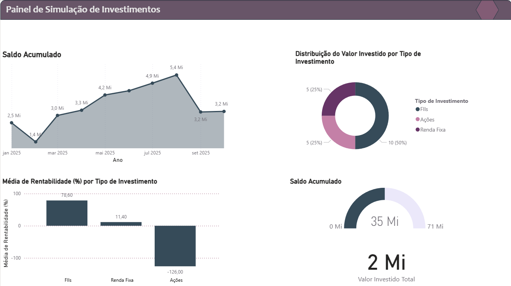

# Identificando Habilidades Remuneráveis

Projeto desenvolvido como parte de um bootcamp da DIO, com o objetivo de identificar habilidades pessoais que possuem valor de mercado e demonstrar, na prática, como elas podem ser aplicadas e monetizadas.

A proposta deste projeto é unir **autoconhecimento profissional**, **análise de mercado** e **demonstração técnica**, utilizando análise financeira e visualização de dados como prova de conceito.

---

## 🎯 Objetivo do Projeto

- Identificar habilidades técnicas e analíticas com potencial de remuneração  
- Avaliar a demanda dessas habilidades no mercado  
- Explorar caminhos de monetização  
- Demonstrar essas habilidades por meio de um **dashboard interativo no Power BI**

---

## 🧠 Inventário de Habilidades

### O que as pessoas costumam elogiar em mim?
- Capacidade de explicar conceitos financeiros de forma simples e acessível

### Em quais atividades me sinto confiante?
- Análise de investimentos  
- Planejamento financeiro pessoal  
- Criação de dashboards no Power BI  

### Que tipo de ajuda costumo oferecer?
- Orientação sobre investimentos  
- Organização financeira pessoal  

### Quais atividades realizo com facilidade?
- Consultas SQL para análise e organização de dados  
- Estruturação de informações financeiras para análise  

### Que tipo de conteúdo consumo com frequência?
- Mercado financeiro  
- Política  
- Análise de dados  
- Tecnologia  

---

## 📊 Cruzamento com Necessidades do Mercado

- **Existe demanda por essas habilidades?**  
  Sim. Educação financeira e análise de dados estão entre as áreas com alta demanda, tanto para pessoas físicas quanto para pequenas empresas.

- **Alguém pagaria por isso?**  
  Sim. Há mercado para consultoria financeira, mentorias e criação de dashboards para apoio à tomada de decisão.

- **Essas habilidades resolvem problemas reais?**  
  Sim. Ajudam na organização financeira, melhor visualização de dados e compreensão de cenários de investimento.

---

## 💰 Caminhos de Monetização

- Mentorias em educação financeira  
- Consultoria básica de investimentos  
- Desenvolvimento de dashboards no Power BI para pessoas físicas ou pequenas empresas  
- Serviços de análise e organização de dados financeiros  

**Público-alvo:**
- Pessoas que desejam aprender a investir  
- Pequenas empresas que precisam visualizar dados de forma clara e objetiva  

---

## 📈 Demonstração Prática — Dashboard de Análise de Investimentos

Como demonstração prática das habilidades identificadas, foi desenvolvido um **Painel de Simulação de Análise de Investimentos** no Power BI.

### O dashboard apresenta:

- Evolução do saldo acumulado ao longo do tempo  
- Distribuição do valor investido por tipo de investimento (Ações, FIIs e Renda Fixa)  
- Rentabilidade média por categoria de ativo  
- Indicadores de valor total investido e saldo atual  

📌 **Observação:**  
Os dados utilizados são **fictícios** e têm finalidade exclusivamente educacional e demonstrativa.

### Preview do Dashboard

---

## 🛠️ Tecnologias Utilizadas

- Power BI  
- Conceitos de Análise de Dados  
- Análise Financeira  
- SQL (para estruturação e análise de dados)  

---

## 📌 Considerações Finais

Este projeto demonstra como habilidades técnicas e analíticas podem ser identificadas, estruturadas e aplicadas de forma prática, evidenciando seu potencial de monetização no mercado atual.

Mais do que um exercício teórico, trata-se de uma **prova de conceito baseada em habilidades reais**.
